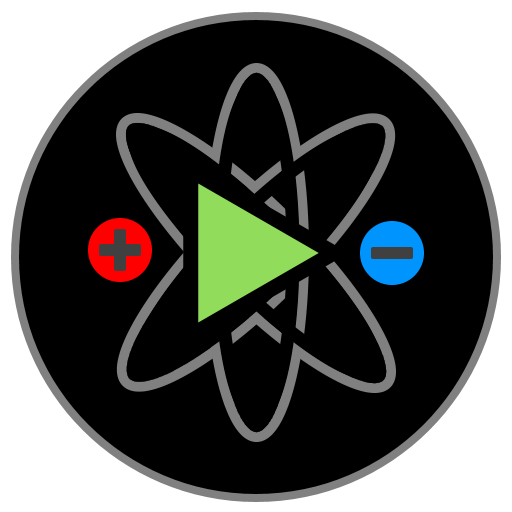

# Charge Hockey

A puzzle game based on the physics of electric charges.

## Android

Charge Hockey is available on Google Play.

## Details

Charge Hockey was written in **java** using [**libGDX**](https://github.com/libgdx/libgdx). Developed with Android Studio.

### Setup

  1. Clone the project (git clone). 
  2. Import it using Android Studio. 
  3. Default 'android' configuration should work.
     Add the following configuration for desktop use:
     
     Desktop (Application):  
       _Main class_: com.mare5x.chargehockey.DesktopLauncher  
       _Working directory_: path_to_project\android\assets  
       _Use classpath of module_: desktop
    
  4. Copy assets/LEVELS/CUSTOM into android/assets/LEVELS/CUSTOM to use custom levels.

### Project structure

Supported projects (_gradle_): desktop and android.

  * ./assets : contains all the _raw_ assets.
    
    Use the levels in CUSTOM/ for consistent benchmarking.

    To generate PNGs from SVGs use the python script in assets/gdx-texturepacker-4.7.3/svg2png.py.

    To generate texturepacks use gdx-texturepacker.

    To copy levels to the android/assets/ folder use: assets/LEVELS/levels.py.

  * ./android : android project.  

    ./android/assets : contains the actual packaged assets.  
    ./android/src    : android specific source files.  
    ./android/res    : launcher icons.

    AndroidManifest.xml is important!

    **Note**: using proguard and app bundles. Google Play app signing.

  * ./core : source code shared by all projects.

    ChargeHockeyGame.java contains an abstract class which is subclassed and run by platform specific projects (android and desktop). 

  * ./desktop : desktop project.

    ./desktop/src : desktop specific source files.
